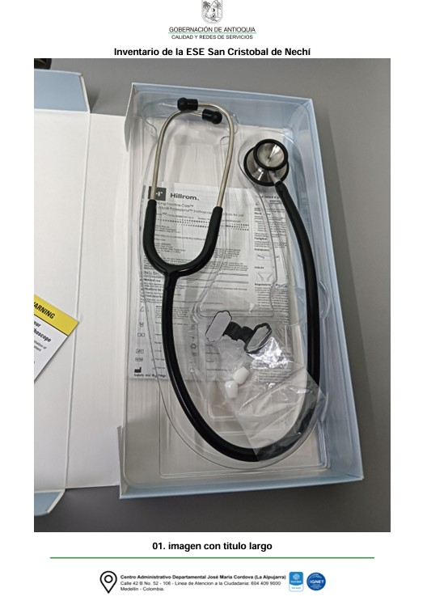

# Generador de Informe Fotográfico de Inventario para ESE de Antioquia


## Descripción

Este proyecto corresponde a una herramienta desarrollada en Python para la generación automática de un documento PDF institucional destinado al **registro fotográfico ordenado de inventarios** en las **Empresas Sociales del Estado (ESE) del departamento de Antioquia**.

La solución surge de una necesidad operativa concreta: aunque los ingenieros encargados de las visitas e inventarios tomaban fotografías de los elementos presentes en hospitales y demás sedes asistenciales, no existía un mecanismo estandarizado, organizado y formal que permitiera dejar evidencia clara, trazable y presentable de cada objeto inventariado. Esta limitación dificultaba la consolidación de soportes documentales confiables, especialmente en escenarios de revisión, seguimiento y control.

En ese sentido, esta herramienta permite transformar un conjunto de imágenes en un **documento oficial en formato PDF**, con una estructura uniforme por página, incorporando encabezado institucional, pie de página y rotulación individual de cada evidencia fotográfica. De esta manera, se facilita la construcción de soportes documentales útiles para procesos administrativos, técnicos y de auditoría, incluyendo aquellos requeridos ante organismos de control como la **Contraloría General de la Nación**.

## Objetivo

Generar de manera automática un informe fotográfico en PDF que consolide, organice y presente evidencias visuales del inventario de una ESE, manteniendo una estructura homogénea y fácilmente verificable.

## ¿Qué hace el programa?

El programa:

- Verifica que existan las carpetas necesarias para operar.
- Toma las imágenes almacenadas en una carpeta local.
- Inserta cada imagen en una página independiente de un archivo PDF.
- Agrega a cada página una plantilla institucional con:
  - encabezado,
  - pie de página,
  - nombre de la ESE,
  - título derivado del nombre del archivo de imagen.
- Exporta un único documento final llamado `inventario.pdf`.

De acuerdo con el código, el sistema trabaja con una carpeta de imágenes (`images`), una carpeta de encabezados (`encabezados`) y genera un PDF final con tamaño de página A4. Además, recorre automáticamente todas las imágenes en formato `.jpg`, `.jpeg` y `.png`, organizándolas alfabéticamente para incorporarlas una por una al documento final. :contentReference[oaicite:0]{index=0} :contentReference[oaicite:1]{index=1}


## Ejemplo final
A continuación se muestra un ejemplo de como queda nombrada cada hoja del archivo pdf que permite tener control sobre el invetario de los equipos médicos de una ESE en particular.


## Estructura del proyecto

Se espera una estructura de carpetas como la siguiente:

```bash
proyecto/
│
├── images/
│   ├── foto_001.jpg
│   ├── foto_002.jpg
│   └── ...
│
├── encabezados/
│   ├── no_borrar_1.png
│   └── no_borrar_2.png
│
├── main.py
└── inventario.pdf